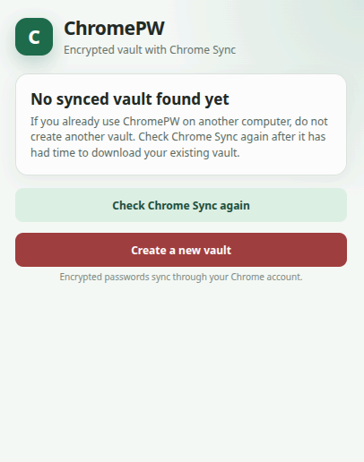
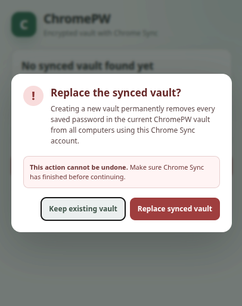
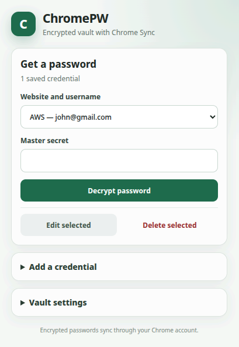

# ChromePW

ChromePW is a small Chrome extension for manually storing encrypted passwords and synchronizing them through Chrome Sync. It does not inspect websites, autofill forms, make its own network requests, or request access to browsing activity.

## Features

- Set up one master secret (minimum 12 characters).
- Save a website label, username, and password.
- Select a saved website and username, enter the master secret, and decrypt the password.
- Copy, show, or hide a decrypted password.
- Edit and delete credentials.
- Change the master secret and re-encrypt every saved password.
- Synchronize the encrypted vault between Chrome browsers signed into the same Google account.
- Keep master-secret fields hidden on startup unless creating a brand-new vault or performing a protected operation.
- Check Chrome Sync before offering vault creation; creating a replacement requires an explicit destructive warning and master secret.
- Reset the vault if the master secret is lost.

## Install in Chrome

1. Open `chrome://extensions`.
2. Enable **Developer mode**.
3. Select **Load unpacked**.
4. Choose this project directory.
5. Pin ChromePW from the extensions menu if desired.

Click the ChromePW toolbar icon to create or use the vault.

## How to use ChromePW

### 1. Let ChromePW check Sync first

When ChromePW opens on a new computer, it checks Chrome Sync for an existing vault. If no vault appears yet, wait for Chrome Sync to finish and select **Check Chrome Sync again**.

Do not create a new vault if you already use ChromePW on another computer.



### 2. Create a vault only when you need a new one

If you are certain that no existing vault should be used, select **Create a new vault**. ChromePW shows a confirmation before replacing synchronized data.

Creating a new vault removes the previous ChromePW passwords from every computer using the same Chrome Sync account. Choose **Keep existing vault** unless you intend to replace it.



After confirming, enter and confirm a master secret of at least 12 characters. The master secret is never saved and cannot be recovered.

### 3. Save and retrieve credentials

Open **Add a credential** to save a website name, username, and password. Enter the master secret to encrypt and save the password.

To retrieve a password:

1. Select the website and username.
2. Enter the master secret.
3. Select **Decrypt password**.
4. Copy the password or hide it when finished.



Use **Edit selected** or **Delete selected** to manage a credential. Open **Vault settings** to change the master secret or reset the vault.

## Security design

- The master secret is never stored.
- PBKDF2-HMAC-SHA-256 with 600,000 iterations and a random 16-byte salt derives an AES-256-GCM key.
- Each password has a new random 12-byte IV and authenticated encryption.
- Passwords are stored in `chrome.storage.sync`; website labels and usernames remain plaintext so they can be selected before entering the master secret.
- Each credential is stored as a separate sync item to respect Chrome's per-item storage quota.
- Vault configurations use immutable unique IDs, so first-run setup on a partially synced computer cannot overwrite an established vault.
- If several vault records arrive out of order, ChromePW consistently selects the oldest established vault.
- An explicitly created replacement is marked as the active vault and removes the previous synchronized vault from other computers.
- A partially synchronized device never deletes credentials merely because they are absent from its current snapshot.
- ChromePW does not keep a second vault in `chrome.storage.local`; earlier local-backup keys are deleted without being read or uploaded, so stale local data cannot affect other computers.
- The extension requests only Chrome's `storage` permission and has no content scripts, host permissions, background worker, analytics, or network code.
- Closing the popup discards entered secrets and decrypted values from the extension page.

Chrome handles transport and account synchronization; the extension itself never receives Google credentials. Chrome Sync must be enabled for the same Google account on each computer, and the extension must have the same ID on each installation.

The master secret cannot be recovered. Anyone who can access the synchronized ciphertext can attempt offline guesses, so use a long and unique secret. ChromePW cannot protect data on a compromised computer or from malicious browser extensions with sufficient access.

## Development

The extension has no runtime dependencies.

```bash
npm test
npm run check
```
